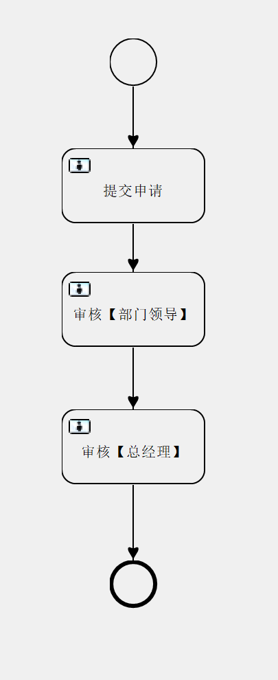
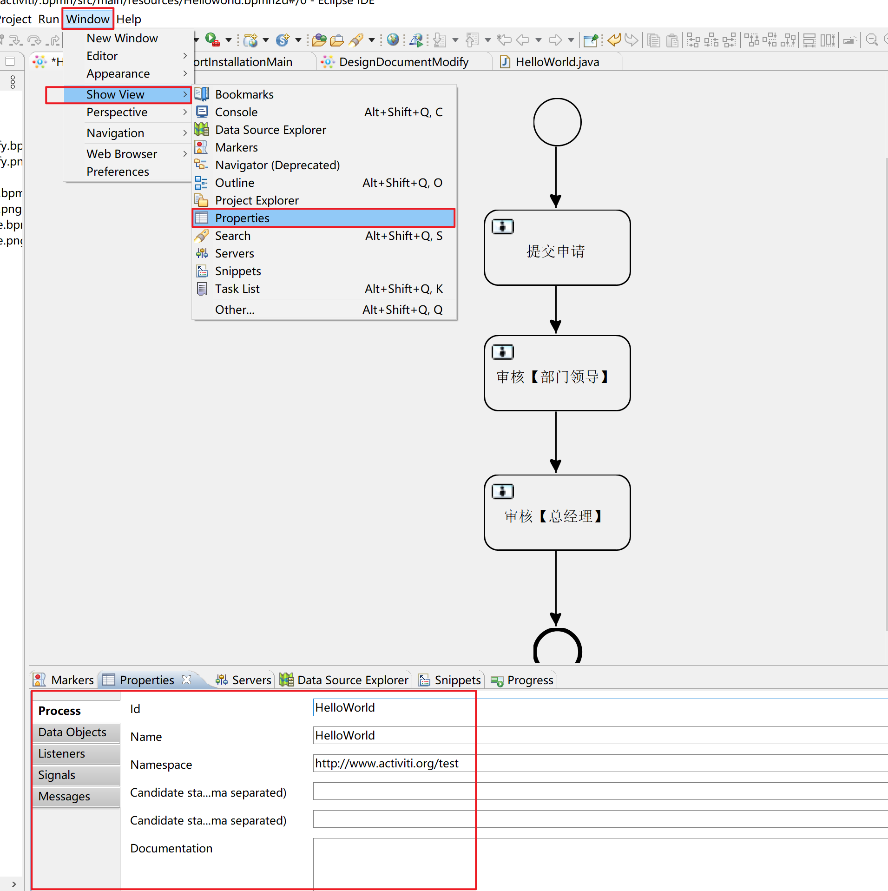
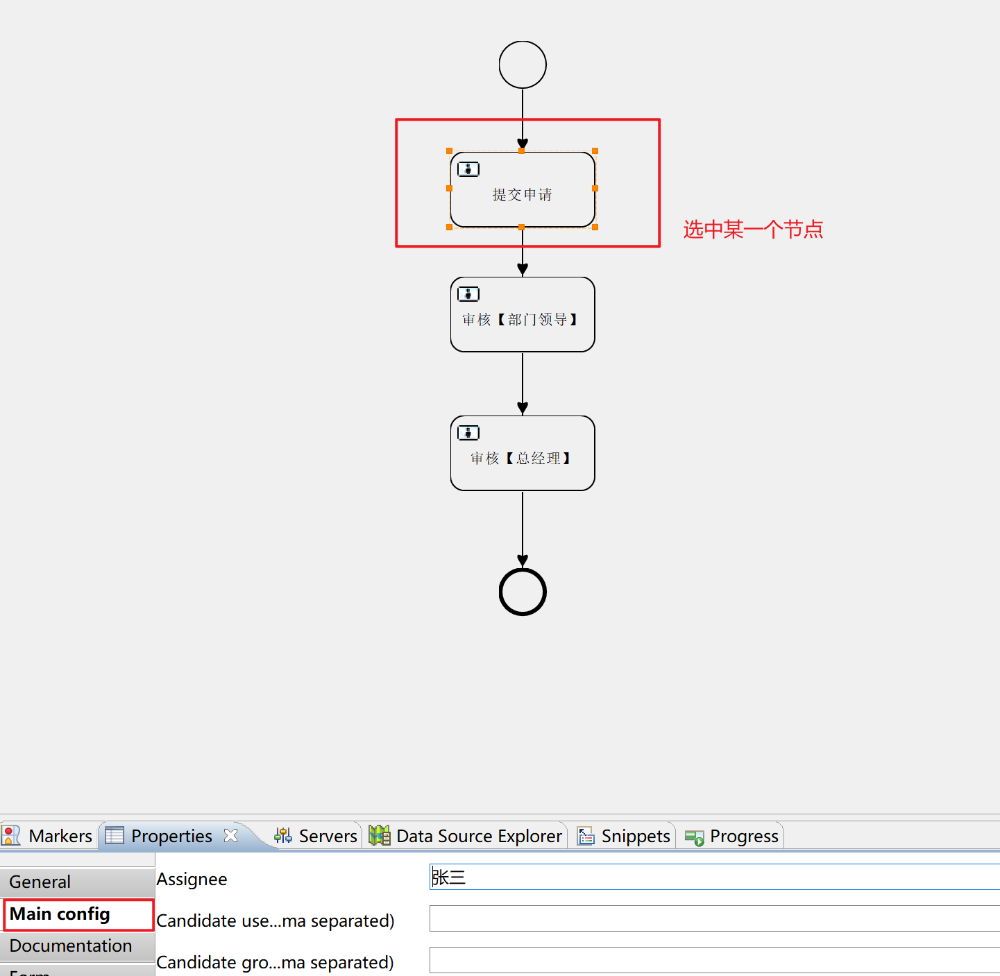
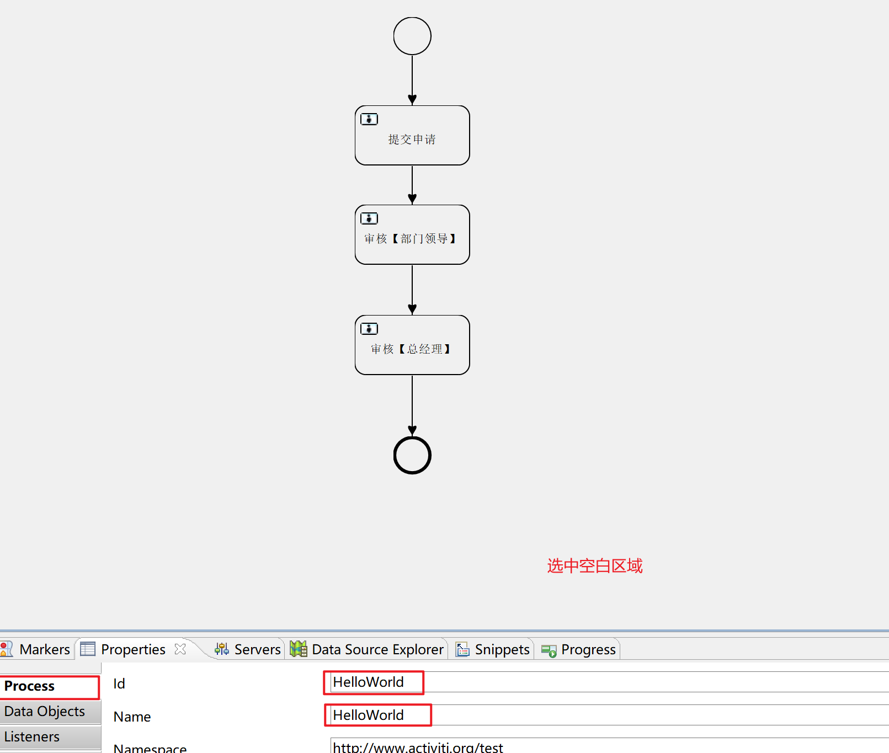
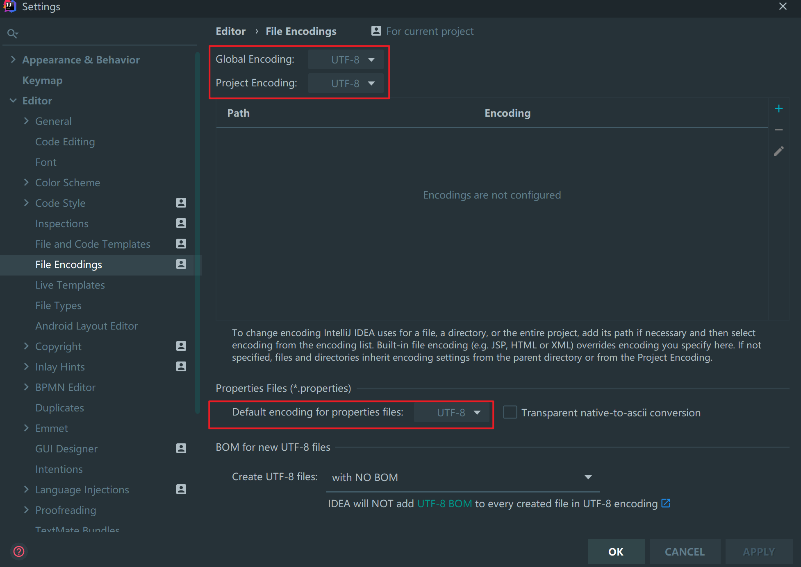
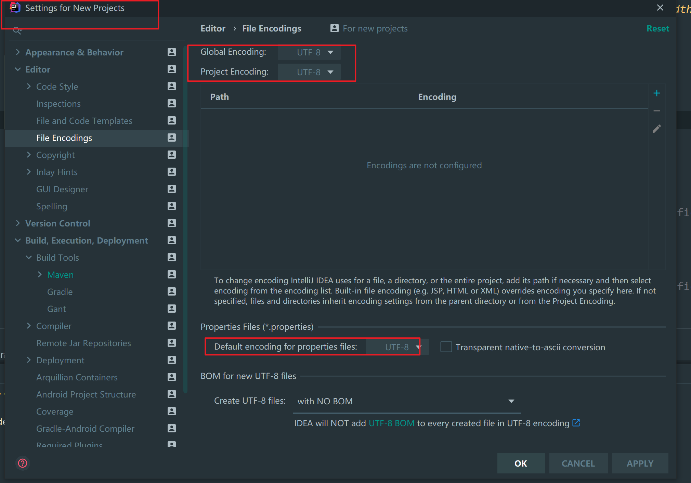
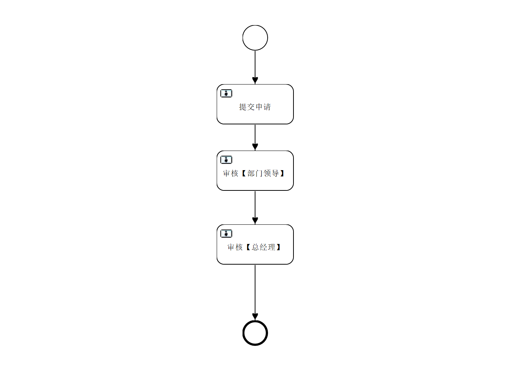
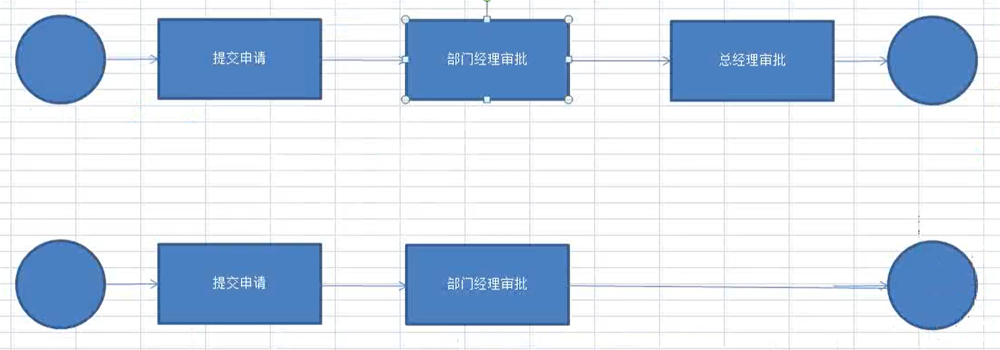

# Activiti

Activiti项目是一项新的基于Apache许可的开源BPM平台,工作流在银行系统，政务系统，办公系统，物流系统，财务系统，电力系统等都有非常广泛的应用

## 生活中的工作流

- 请假

- 报销
- 申请什么
- 购物

## 工作流的概念

工作流(Workflow)，就是“业务过程的部分或整体在计算机应用环境下的自动化”，它主要解决的是“使在多个参与者之间按照某种预定义的规则传递文档、信息或任务的过程自动进行，从而实现某个预期的业务目标，或者促使此目标的实现”。

工作流管理系统(Workflow Management System, WfMS)是一个软件系统，它完成工作量的定义和管理，并按照在系统中预先定义好的工作流规则进行工作流实例的执行。工作流管理系统不是企业的业务系统，而是为企业的业务系统的运行提供了一个软件的支撑环境。

工作流管理联盟(WfMC，Workflow Management Coalition)给出的关于工作流管理系统的定义是：工作流管理系统是一个软件系统，它通过执行经过计算的流程定义去支持一批专门设定的业务流程。工作流管理系统被用来定义、管理、和执行工作流程。

### 工作流管理系统的目标

管理工作的流程以确保工作在正确的时间被期望的人员所执行——在自动化进行的业务过程中插入人工的执行和干预。 


## Activiti介绍

### 概述

Activiti5是由Alfresco软件在2010年5月17日发布的业务流程管理（BPM）框架，它是覆盖了业务流程管理、工作流、服务协作等领域的一个开源的、灵活的、易扩展的可执行流程语言框架。Activiti基于Apache许可的开源BPM平台，创始人Tom Baeyens是JBoss jBPM的项目架构师，它特色是提供了eclipse插件，开发人员可以通过插件直接绘画出业务

流程图：


### 工作流引擎

ProcessEngine对象，这是Activiti工作的核心。负责生成流程运行时的各种实例及数据、监控和管理流程的运行。

### BPMN

业务流程建模与标注（Business Process Model and Notation，BPMN) ，描述流程的基本符号，包括这些图元如何组合成一个业务流程图（Business Process Diagram）

### 数据库（先看再说）

Activiti数据库支持：

> Activiti的后台是有数据库的支持，所有的表都以ACT_开头。 第二部分是表示表的用途的两个字母标识。 用途也和服务的API对应。
>
> ACT_RE_*: 'RE'表示repository。 这个前缀的表包含了流程定义和流程静态资源 （图片，规则，等等）。
>
> ACT_RU_*: 'RU'表示runtime。 这些运行时的表，包含流程实例，任务，变量，异步任务，等运行中的数据。 Activiti只在流程实例执行过程中保存这些数据， 在流程结束时就会删除这些记录。 这样运行时表可以一直很小速度很快。
>
> ACT_ID_*: 'ID'表示identity。 这些表包含身份信息，比如用户，组等等。
>
> ACT_HI_*: 'HI'表示history。 这些表包含历史数据，比如历史流程实例， 变量，任务等等。
>
> ACT_GE_*: 通用数据， 用于不同场景下，如存放资源文件。


#### 资源库流程规则表

> 1)	act_re_deployment 	部署信息表
>
> 2)	act_re_model  		流程设计模型部署表
>
> 3)	act_re_procdef  		流程定义数据表

#### 运行时数据库表

> 1)	act_ru_execution		运行时流程执行实例表
>
> 2)	act_ru_identitylink		运行时流程人员表，主要存储任务节点与参与者的相关信息
>
> 3)	act_ru_task			运行时任务节点表
>
> 4)	act_ru_variable		运行时流程变量数据表

#### 历史数据库表

> 1)	act_hi_actinst 		历史节点表
>
> 2)	act_hi_attachment		历史附件表
>
> 3)	act_hi_comment		历史意见表
>
> 4)	act_hi_identitylink		历史流程人员表
>
> 5)	act_hi_detail			历史详情表，提供历史变量的查询
>
> 6)	act_hi_procinst		历史流程实例表
>
> 7)	act_hi_taskinst		历史任务实例表
>
> 8)	act_hi_varinst			历史变量表

#### 组织机构表

> 1)	act_id_group		用户组信息表
>
> 2)	act_id_info			用户扩展信息表
>
> 3)	act_id_membership	用户与用户组对应信息表
>
> 4)	act_id_user			用户信息表

​         **这四张表很常见，基本的组织机构管理，关于用户认证方面建议还是自己开发一套，组件自带的功能太简单，使用中有很多需求难以满足** 

#### 通用数据表

> 1)	act_ge_bytearray		二进制数据表
>
> 2)	act_ge_property			属性数据表存储整个流程引擎级别的数据,初始化表结构时，会默认插入三条记录，


## 准备工作+插件安装

视频是eclipse中操作，跳过。Idea装actiBPM，好像很多年前的插件，只有在idea官网下载插件，然后安装到idea里面。


2020.7.23 idea这个插件做的很垃圾，也没其他插件。我妥协啦，搞了个eclipse。（^-^）

安装过程中出现问题，打开vpn，就解决啦。

## Activiti5开发

### pom

```xml
<properties>
        <spring.version>4.3.13.RELEASE</spring.version>
        <mysql.version>5.1.39</mysql.version>
        <!-- 注意只能使用2.0以下的版本 -->
        <activiti.version>5.22.0</activiti.version>
        <mybatis.version>3.4.6</mybatis.version>
        <fileupload.version>1.3.1</fileupload.version>
        <!-- 注意只能使用2.0以下的版本 -->
        <log4j.version>1.2.17</log4j.version>
    </properties>
    
    <dependencies>
        <dependency>
            <groupId>org.activiti</groupId>
            <artifactId>activiti-engine</artifactId>
            <version>${activiti.version}</version>
        </dependency>
        <dependency>
            <groupId>mysql</groupId>
            <artifactId>mysql-connector-java</artifactId>
            <version>${mysql.version}</version>
        </dependency>
        <dependency>
            <groupId>org.springframework</groupId>
            <artifactId>spring-aspects</artifactId>
            <version>${spring.version}</version>
        </dependency>
        <dependency>
            <groupId>org.springframework</groupId>
            <artifactId>spring-aop</artifactId>
            <version>${spring.version}</version>
        </dependency>
        <dependency>
            <groupId>org.springframework</groupId>
            <artifactId>spring-context</artifactId>
            <version>${spring.version}</version>
        </dependency>
        <dependency>
            <groupId>org.springframework</groupId>
            <artifactId>spring-core</artifactId>
            <version>${spring.version}</version>
        </dependency>
        <dependency>
            <groupId>org.springframework</groupId>
            <artifactId>spring-expression</artifactId>
            <version>${spring.version}</version>
        </dependency>
        <dependency>
            <groupId>org.springframework</groupId>
            <artifactId>spring-jdbc</artifactId>
            <version>${spring.version}</version>
        </dependency>
        <dependency>
            <groupId>org.springframework</groupId>
            <artifactId>spring-tx</artifactId>
            <version>${spring.version}</version>
        </dependency>
       
        <dependency>
            <groupId>org.mybatis</groupId>
            <artifactId>mybatis</artifactId>
            <version>${mybatis.version}</version>
        </dependency>

        <!-- 文件上传 -->
        <dependency>
            <groupId>commons-fileupload</groupId>
            <artifactId>commons-fileupload</artifactId>
            <version>${fileupload.version}</version>
        </dependency>

        <!-- log4j -->
        <dependency>
            <groupId>log4j</groupId>
            <artifactId>log4j</artifactId>
            <version>${log4j.version}</version>
        </dependency>
        <dependency>
            <groupId>org.slf4j</groupId>
            <artifactId>slf4j-api</artifactId>
            <version>1.7.25</version>
        </dependency>
        <dependency>
            <groupId>org.slf4j</groupId>
            <artifactId>slf4j-simple</artifactId>
            <version>1.7.25</version>
        </dependency>
    </dependencies>
```


### 初始化数据库方式

#### 第一种

```java
/**
	 * 初始化方式一
	 */
	@Test
	public void initTable() {
		//1,创建Activiti配置对象实例
		ProcessEngineConfiguration engineConfiguration = ProcessEngineConfiguration.createStandaloneInMemProcessEngineConfiguration();

		//直接设置数据库的信息也可以 或者用DataSource设置
		engineConfiguration.setJdbcUrl("jdbc:mysql://47.92.208.93:3306/activiti");
		engineConfiguration.setJdbcDriver("com.mysql.jdbc.Driver");
		engineConfiguration.setJdbcUsername("root");
		engineConfiguration.setJdbcPassword("123456");

		//2,设置建表策略
		/**
		 * ProcessEngineConfiguration.DB_SCHEMA_UPDATE_TRUE  如果数据库没有表，自动创建表
		 * ProcessEngineConfiguration.DB_SCHEMA_UPDATE_FALSE  不自动创建表,如果没有表也不会创建 
		 * ProcessEngineConfiguration.DB_SCHEMA_UPDATE_CREATE_DROP 每次都先删除表再创建表  --有异常
		 *
		 * drop-create 代表如果数据库里面有表，那么先删除再创建
		 * 注意drop-create和create-drop的区别
		 */

		//engineConfiguration.setDatabaseSchemaUpdate("drop-create");
		engineConfiguration.setDatabaseSchemaUpdate(ProcessEngineConfiguration.DB_SCHEMA_UPDATE_TRUE);

		//3,得到程序引擎实例
		ProcessEngine engine = engineConfiguration.buildProcessEngine();
		System.out.println(engine);
	}
```


#### 第二种

首先需要**activiti.cfg.xml** 文件，在resource下面

```xml
<?xml version="1.0" encoding="UTF-8"?>
<beans xmlns="http://www.springframework.org/schema/beans"
       xmlns:xsi="http://www.w3.org/2001/XMLSchema-instance"
       xsi:schemaLocation="http://www.springframework.org/schema/beans
        http://www.springframework.org/schema/beans/spring-beans.xsd">

    <bean id="processEngineConfiguration" class="org.activiti.engine.impl.cfg.StandaloneProcessEngineConfiguration">
        <property name="jdbcDriver" value="com.mysql.jdbc.Driver"></property>
        <property name="jdbcUrl" value="jdbc:mysql://47.92.208.93:3306/activiti"></property>
        <property name="jdbcUsername" value="root"></property>
        <property name="jdbcPassword" value="123456"></property>

        <!--            
            flase： 默认值。activiti在启动时，会对比数据库表中保存的版本，如果没有表或者版本不匹配，将抛出异常。
            true： activiti会对数据库中所有表进行更新操作。如果表不存在，则自动创建。
            create_drop： 在activiti启动时创建表，在关闭时删除表（必须手动关闭引擎，才能删除表）。
            drop-create： 在activiti启动时删除原来的旧表，然后在创建新表（不需要手动关闭引擎）。 
        -->
        <!--用那种方式就将上面的替换value里面的值-->
        <property name="databaseSchemaUpdate" value="true"></property> 
    </bean>
</beans>

```


```java
/**
* 初始化数据表二 
*/
@Test
public void initTable2() {
		//得到流程引擎 注意两步哦 后面.了两下
		ProcessEngine engine = ProcessEngineConfiguration.createProcessEngineConfigurationFromResource("/activiti.cfg.xml").buildProcessEngine();
		
		System.out.println(engine);
	}
```


#### 第三种

```java
/**
	 * 初始化数据表三
	 */
	@Test
	public void initTable3() {
//使用这种方式必须创建activiti.cfg.xml  并配置数据库信息，名字不能变，因为源码里面会默认扫描这个文件。
		ProcessEngine engine = ProcessEngines.getDefaultProcessEngine();
		System.out.println(engine);
	}
```

第三种方式很简单，但是为什么一句话就会生效呢？

原因是下面，源码里面:


其实默认有。使用这种方式必须创建activiti.cfg.xml  并配置数据库信息，名字不能变，因为源码里面会默认扫描这个文件。


### activiti.cfg.xml的说明

就是关于配置一些数据源，数据库连接池等。

在后续使用过程中，发现中文写入数据库的时候会出现？，这应该是编码的问题。看数据库编码没有问题就是utf-8，那就是传过去的时候有问题。

所以需要在数据库连接后面加： **?characterEncoding=utf-8**

```xml
<?xml version="1.0" encoding="UTF-8"?>
<beans xmlns="http://www.springframework.org/schema/beans"
       xmlns:xsi="http://www.w3.org/2001/XMLSchema-instance"
       xsi:schemaLocation="http://www.springframework.org/schema/beans
        http://www.springframework.org/schema/beans/spring-beans.xsd">

    <bean id="processEngineConfiguration" class="org.activiti.engine.impl.cfg.StandaloneProcessEngineConfiguration">
        <property name="jdbcDriver" value="com.mysql.jdbc.Driver"></property>
        <property name="jdbcUrl" value="jdbc:mysql://47.92.208.93:3306/activiti?characterEncoding=utf-8"></property>
        <property name="jdbcUsername" value="root"></property>
        <property name="jdbcPassword" value="123456"></property>

        <!--            
            flase： 默认值。activiti在启动时，会对比数据库表中保存的版本，如果没有表或者版本不匹配，将抛出异常。
            true： activiti会对数据库中所有表进行更新操作。如果表不存在，则自动创建。
            create_drop： 在activiti启动时创建表，在关闭时删除表（必须手动关闭引擎，才能删除表）。
            drop-create： 在activiti启动时删除原来的旧表，然后在创建新表（不需要手动关闭引擎）。 
        -->
        <!--用那种方式就将上面的替换value里面的值-->
        <property name="databaseSchemaUpdate" value="true"></property> 
    </bean>
</beans>

```


## 核心API

### 1，ProcessEngine

说明：

1. 在Activiti中最核心的类，其他的类都是由他而来。
2. 产生方式。

```java
ProcessEngine engine = ProcessEngines.getDefaultProcessEngine();
```

在前看到了两种创建ProcessEngine（流程引擎）的方式，而这里要简化很多，调用ProcessEnginesgetDefaultProceeEngine方法时会自动加载classpath下名为activiti.cfg.xml文件。


3. 可以产生RepositoryService
4. 可以产生RuntimeService
5.  可以产生TaskService

6. 各个Service的作用

| **RepositoryService** | **管理流程定义**                                 |
| :-------------------: | :----------------------------------------------- |
|  **RuntimeService**   | **执行管理，包括启动、推进、删除流程实例等操作** |
|    **TaskService**    | **任务管理**                                     |
|  **HistoryService**   | **历史管理(执行完的数据的管理)**                 |
|  **IdentityService**  | **组织机构管理**                                 |
|      FormService      | 一个可选服务，任务表单管理                       |
|    ManagerService     | 管理器服务                                       |


```java
//使用这种方式必须创建activiti.cfg.xml  并配置数据库信息，名字不能变，因为源码里面会默认扫描这个文件。
ProcessEngine engine = ProcessEngines.getDefaultProcessEngine();
System.out.println(engine);

//流程图的部署 发布 修改 删除的服务器 ACT_RE_PROCDEF ACT_RE_DEPLOYMENT ACT_RE_MODEL ACT_GE_BYTEARRAY
RepositoryService repositoryService = engine.getRepositoryService();

//流程的运行 ACT_RU_EVENT_SUBSCR ACT_RU_EXECUTION ACT_RU_IDENTITYLINK ACT_RU_JOB ACT_RU_TASK ACT_RU_VARIABLE ACT_RU_VARIABLE
RuntimeService runtimeService = engine.getRuntimeService();
TaskService taskService = engine.getTaskService();

//查询历史记录的服务器 ACT_HI_ACTINST ACT_HI_ATTACHMENT ACT_HI_COMMENT ACT_HI_DETAIL ACT_HI_IDENTITYLINK ACT_HI_PROCINST ACT_HI_TASKINST ACT_HI_VARINST
HistoryService historyService = engine.getHistoryService();

//页面表单（了解）
FormService formService = engine.getFormService();

//对工作流用户管理 ACT_ID_GROUP ACT_ID_INFO ACT_ID_MEMBERSHIP ACT_ID_USER
IdentityService identityService = engine.getIdentityService();

//管理器
ManagementService managementService = engine.getManagementService();
```


-------------


### **2，ReposioryService**

是Activiti的仓库服务类。所谓的仓库指流程定义文档的两个文件，bpmn文件和流程图片。

1)产生方式


2)可以产生DeploymentBuilder，用来定义流程部署的相关参数


3)删除流程定义


------

### **3，RuntimeService**

是activiti的流程执行服务类。可以从这个服务类中获取很多关于流程执行相关的信息。

------


### 4，TaskService

是activiti的任务服务类。可以从这个类中获取任务的信息。

------


### 5，HistoryService

是activiti的查询历史信息的类。在一个流程执行完成后，这个对象为我们提供查询历史信息。

------


### 6，ProcessDefinition  流程定义

act_re_procdef

流程定义类。可以从这里获得资源文件等。当流程图被部署后，查询出来的数据就是流程定义的数据。

------


### 7，ProcessInstance 流程实例

代表流程定义的执行实例。如范冰冰请了一天的假，她就必须发出一个流程实例的申请。一个流程实例包括了所有的运行节点。我们可以利用这个对象来了解当前流程实例的进度等信息。流程实例就表示一个流程从开始到结束的最大的流程分支，即一个流程中流程实例只有一个。

------


### 8，Execution

act_ru_execution

Activiti用这个对象去描述流程执行的每一个节点。在没有并发的情况下，Execution就是同ProcessInstance。流程按照流程定义的规则执行一次的过程，就可以表示执行对象Execution。

如图为ProcessInstance的源代码，


从源代码中可以看出ProcessInstance就是Execution。但在现实意义上有所区别， 


在单线流程中，如上图的贷款流程，ProcessInstance与Execution是一致的。  

这个例子有一个特点，wire money(汇钱)和archive(存档)是并发执行的。	这个时候，总线路代表ProcessInstance，而分线路中每个活动代表Execution。

总结。

\* 一个流程中，执行对象可以存在多个，但是流程实例只能有一个。

\* 当流程按照规则只执行一次的时候，那么流程实例就是执行对象。


#### 对流程定义，流程实例，执行的理解


流程定义就是上面的流程，流程图有了以后，流程定义数据就有啦。

流程实例就是每一个流程定义下面，可以有好多流程实例。

execution对象，用来描述流程执行的每一个节点。


同一个instance实例，如果有多个分支，就叫execution，不同的execution。


### 9，TaskInstance 任务实例 

act_ru_task

https://www.activiti.org/designer/update/


## HelloWord程序（模拟流程的执行）

### 画流程图



#### 设置属性

在画完流程图以后，需要填写属性，就需要找到这个菜单




#### 设置任务办理人




#### 修改流程id和name




##### 遇到的问题

因为eclipse默认是GBK格式，如果没有修改成utf-8的时候，写到数据库，就会出现乱码。

将eclipse中的Utf-8代码复制到Idea中，进行流程部署，这个Helloworld.bpmn文件，就会变成GBK。

原因是Idea设置编码少设置一个utf-8，这几个地方都设置了才可以。



这种方式只对当前文件项目有作用。想让对新项目有作用，需要下面这种设置



##### 一些表的名称功能

```sql
#RepositoryService
SELECT * FROM ACT_GE_BYTEARRAY;    #二进制文件表
SELECT * FROM ACT_RE_DEPLOYMENT;   #流程部署表
SELECT * FROM ACT_RE_PROCDEF;			 #流程定义
SELECT * FROM ACT_GE_PROPERTY;		 #工作流的ID算法和版本信息表

#RuntimeService  TaskService
SELECT * FROM ACT_RU_EXECUTION;    #流程启动一次只要没有执行完，就会有一条记录
SELECT * FROM ACT_RU_TASK;				 #可能有多条数据
SELECT * FROM ACT_RU_VARIABLE;		 #记录流程运行时的流程变量
SELECT * FROM ACT_RU_IDENTITYLINK; #存放流程办理人的信息

#HistroyService 
SELECT * FROM ACT_HI_PROCINST;     #历史流程实例
SELECT * FROM ACT_HI_TASKINST;     #历史任务实例
SELECT * FROM ACT_HI_ACTINST;      #历史活动节点表
SELECT * FROM ACT_HI_VARINST;      #历史流程变量表
SELECT * FROM ACT_HI_IDENTITYLINK; #历史办理人表
SELECT * FROM ACT_HI_COMMENT;      #批注表
SELECT * FROM ACT_HI_ATTACHMENT;   #附件表

#IdentityService
SELECT * FROM ACT_ID_GROUP;        #角色
```


### 流程部署定义

```java
/**
* 部署流程定义
*/
@Test
public void deploymentProcessDefinition() {

    RepositoryService repositoryService = this.processEngine.getRepositoryService();
    Deployment deployment = repositoryService.createDeployment()//与流程定义和部署对象相关的Service
        .name("请假流程001")//添加部署的名称

        .addClasspathResource("Helloworld1.bpmn") //从classpath的资源中加载，一次只能加载一个文件
        //.addClasspathResource("Helloworld.png") //从classpath的资源中加载，一次只能加载一个文件
        .deploy();//完成部署

    System.out.println("部署ID：" + deployment.getId());//1
    System.out.println("部署名称：" + deployment.getName());//helloworld入门程序 
}
```


### 启动流程

```java
/**
* 启动流程
*/
@Test
public void startProcess() {
    RuntimeService runtimeService = this.processEngine.getRuntimeService();
    String processDefinitionId = "HelloWorld:1:4";
    String processDefinitionkey = "HelloWorld";
    runtimeService.startProcessInstanceByKey(processDefinitionkey);
    System.out.println("流程启动成功");
}
```


### 查询任务

```java
/**
* 查询任务
*/
@Test
public void findTask() {
    TaskService taskService = this.processEngine.getTaskService();
    String assignee = "王五";
    List<Task> list = taskService.createTaskQuery().taskAssignee(assignee).list();

    if (null != list && list.size() > 0)
        for (Task task : list) {
            System.out.println("任务ID:" + task.getId());
            System.out.println("，流程实例ID:" + task.getProcessInstanceId());
            System.out.println("流程任务ID:" + task.getExecutionId());
            System.out.println("流程定义ID:" + task.getProcessDefinitionId());
            System.out.println("任务名称:" + task.getName());
            System.out.println("任务办理人:" + task.getAssignee());
            System.out.println("####################################");
        }
}
```


### 办理任务

```java
/**
* 办理任务
*/	
@Test
public void completeTask(){
    TaskService taskService = this.processEngine.getTaskService();
    String taskId = "10002";
    taskService.complete(taskId);
    System.out.println("任务完成");
}
```


## 管理流程定义

功能 ： 对流程的增加、修改、删除、查询。

act_ge_bytearray 、act_re_deployment、act_re_procdef


### 流程图



### 部署流程两种方式

#### classpath

```java
/**
* 部署流程使用classpath
*/
@Test
public void deployProcess01() {
    RepositoryService repositoryService = this.processEngine.getRepositoryService();
    Deployment deployment = repositoryService.createDeployment()//与流程定义和部署对象相关的Service
        .name("请假流程001")//添加部署的名称
        .addClasspathResource("Helloworld.bpmn") //从classpath的资源中加载，一次只能加载一个文件
        //.addClasspathResource("Helloworld.png") //从classpath的资源中加载，一次只能加载一个文件
        .deploy();//完成部署

    System.out.println("部署ID：" + deployment.getId());//1
    System.out.println("部署名称：" + deployment.getName());//helloworld入门程序 
}
```


#### zip

```java
/**
* 部署流程使用zip
* 流程图文件必须是xxxx.zip
*/
@Test
public void deployProcess02() {
    //如果不加/ 代表从当前包里面找文件
    //InputStream inputStream = this.getClass().getClass().getResourceAsStream("HelloWorld.zip");
    //如果加/ 代表从classpath的根目录中找文件
    InputStream inputStream = this.getClass().getClass().getResourceAsStream("/HelloWorld.zip");
    System.out.println(inputStream);
    RepositoryService repositoryService = this.processEngine.getRepositoryService();
    ZipInputStream zipInputStream = new ZipInputStream(inputStream);
    Deployment deploy = repositoryService.createDeployment()
        .name("请假流程001")
        .addZipInputStream(zipInputStream) // 添加流程图的流
        .deploy();//确定部署
    System.out.println("部署成功, 部署id" + deploy.getId());
}
```


### 查询部署信息 act_re_deployment

```java
/**
	 * 查询流程定义 act_re_deployment
	 */
@Test
public void queryProcessDef() {

    String deploymentId = "1";

    RepositoryService repositoryService = this.processEngine.getRepositoryService();
    //创建部署信息的查询
    //Deployment deployment = repositoryService.createDeploymentQuery()
    //Long count = repositoryService.createDeploymentQuery()
    List<Deployment> deploymentList = repositoryService.createDeploymentQuery()
        //条件
        //.deploymentId(deploymentId)           //根据部署ID去查询
        //.deploymentName(name)                 //根据部署名称去查询
        //.deploymentTenantId(tentantId)        //根据 tenantId去查询  
        //.deploymentNameLike(nameLike)         //根据部署名称模糊查询
        //.deploymentTenantIdLike(tenantIdLike) //根据tenantId模糊查询

        //排序
        //.orderByDeploymentId().asc()          //根据部署ID升序
        //.orderByDeploymenTime().desc()        //根据部署时间降序
        //.orderByDeploymentName()                //根据部署名称升序

        //结果集
        .list(); //查询返回list集合
    //.listPage(firstResult,maxResults) //分页查询返回list集合
    //.singleResult();//返回单个对象
    //.count();

    for (Deployment deployment : deploymentList) {
        System.out.println("部署ID：" + deployment.getId());
        System.out.println("部署名称：" + deployment.getName());
        System.out.println("部署时间：" + deployment.getDeploymentTime());
        System.out.println("-------------------------------------------");
    }

    //		System.out.println(count);

    //		System.out.println("部署ID：" + deployment.getId());
    //		System.out.println("部署名称：" + deployment.getName());
    //		System.out.println("部署时间：" + deployment.getDeploymentTime());
}
```


### 查询流程定义 act_re_procdef

```java
/**
	 * 查询流程定义 act_re_procdef
	 */
@Test
public void queryproDef() {
    RepositoryService repositoryService = this.processEngine.getRepositoryService();
    List<ProcessDefinition> list = repositoryService.createProcessDefinitionQuery()
        //条件
        //.deploymentId(deploymentId)                                              //根据部署ID查询
        //.deploymentIds(processDefinitionIds)                                     //根据部署ID的集合查询Set<String> deploymentIds
        //.processDefinitionId(processDefinitionId)                                // 根据流程定义ID HelloWorld:1:4
        //.processDefinitionIds(processDefinitionIds)                              //根据流程定义的IDS查询

        //.processDefinitionKey(ProcessDefinitionKey)                              //根据流程定义的key值
        //.processDefinitionKeyLike(ProcessDefinitionKeyLike)                      //根据流程定义的key模糊查询

        //.processDefinitionName(ProcessDefinitionName)                            //根据流程定义的名称查询
        //.processDefinitionNameLike(ProcessDefinitionNameLike)                    //根据流程定义的名称模糊查询

        //.processDefinitionResourceName(resourceName)                             //根据流程图的BPMN的文件名称查询
        //.processDefinitionResourceNameLike(resourceNameLike)                     //根据流程图的BPMN文件名称模糊查询

        //.processDefinitionVersion(ProcessDefinitionVersion)                      //根据流程定义的版本查询
        //.processDefinitionVersionGreaterThan(ProcessDefinitionVersion)           //version>num
        //.processDefinitionVersionGreaterThanOrEquals(ProcessDefinitionVersion)   //version>=num
        //.processDefinitionVersionLowerThan(ProcessDefinitionVersion)			   //version<num
        //.processDefinitionVersionLowerThanOrEquals(ProcessDefinitionVersion)       //version<=num

        //排序
        //.orderByDeploymentId()
        //.orderByDeploymentId()
        //.orderByProcessDefinitionId()
        //.orderByProcessDefinitionKey()
        //.orderByProcessDefinitionName()
        //.orderByProcessDefinitionVersion()

        //结果集		
        .list();
    //.listPage(firstResult,maxResults)
    //.count()
    //.singleResult()

    if (null != list && list.size() > 0) {
        for (ProcessDefinition pd : list) {
            System.out.println("流程定义ID:" + pd.getId());                               //流程定义的key+版本+随机生成数
            System.out.println("部署对象ID：" + pd.getDeploymentId());
            System.out.println("流程定义的key:" + pd.getKey());                           //对应helloworld.bpmn文件中的id属性值
            System.out.println("流程定义的名称:" + pd.getName());                         //对应helloworld.bpmn文件中的name属性值
            System.out.println("资源名称bpmn文件:" + pd.getResourceName());               //bpmn的name
            System.out.println("资源名称png文件:" + pd.getDiagramResourceName());         //png的name
            System.out.println("流程定义的版本:" + pd.getVersion());                      //当流程定义的key值相同的相同下，版本升级，默认1
            System.out.println("#########################################################");
        }
    }
}
```


### 删除流程定义信息

首先需要启动流程，再删除流程

```java
/**
* 启动流程
*/
@Test
public void startProcess() {
    RuntimeService runtimeService = this.processEngine.getRuntimeService();
    String processDefinitionkey = "HelloWorld";
    runtimeService.startProcessInstanceByKey(processDefinitionkey);
    System.out.println("流程启动成功");
}

/**
* 删除流程定义
*/
@Test
public void deleteProcessDefinition() {

    RepositoryService repositoryService = this.processEngine.getRepositoryService();
    //使用部署ID，完成删除
    String deploymentId = "5001";

    //不带级联的删除 只能删除没有启动的流程，如果流程启动，就会抛出异常
    //repositoryService.deleteDeployment(deploymentId); //直接删除是会报错的，报错原因是因为有外键

    //级联删除 不管流程是否启动，都能可以删除
    repositoryService.deleteDeployment(deploymentId, true);
    System.out.println("删除成功！");
}
```


### 修改流程定义信息

修改流程图之后重新部署，只要key不变，它的版本号就会+1。




为什么不是把之前的流程图删掉重新部署新的呢？

答：因为原来的流程卡能有没有执行完成的任务，修改流程图以后，只是版本+1，新的流程走新的流程图，旧的流程走旧的流程图。


### 查询流程图

```java
/**
* 查询流程图 根据流程定义ID
* 这里要注意 这里必须要在流程部署的时候先把流程图的png写入，这里才可以再次操作，否则这里输出的不是一个完整的图片
*/
@Test
public void viewProcessImg() {
    RepositoryService repositoryService = this.processEngine.getRepositoryService();
    String processDefinitionId = "HelloWorld:1:4";
    InputStream inputStream = repositoryService.getProcessDiagram(processDefinitionId);

    File file = new File("D:/Helloworld.png");

    try { //对于流来说，一般都会产生异常，所以要有异常处理程序

        //缓冲流 指定缓冲区大小 当时学习的时候的car，将东西分块放入缓冲区中
        BufferedOutputStream outputStream = new BufferedOutputStream(new FileOutputStream(file));

        int len = 0;   //每一次读取到的长度 （将读取到的放入数组，其实就是数组的长度）
        byte[] b = new byte[1024]; //1024保证数组bai的容量，没其它意思
        while ((len = inputStream.read(b)) != -1) { //接收屏幕输入，存入b,同时读取的个数赋值给len
            outputStream.write(b, 0, len); //将字节数组byte写入流中，起始是0，到len
            outputStream.flush();   //强制刷新缓冲区
        }
        outputStream.close();
        inputStream.close();
        System.out.println("输出成功！");
    } catch (Exception e) {
        e.printStackTrace();
    }
}

/**
* 查询流程图 根据流程部署ID
*/
@Test
public void viewProcessImg2() {
    RepositoryService repositoryService = this.processEngine.getRepositoryService();

    //根据流程部署ID查询流程定义对象
    String deploymentId = "1";
    ProcessDefinition processDefinition = repositoryService.createProcessDefinitionQuery().deploymentId(deploymentId).singleResult();

    //从流程定义对象里面查询流程定义ID
    String processDefinitionId = processDefinition.getId();
    InputStream inputStream = repositoryService.getProcessDiagram(processDefinitionId);

    File file = new File("D:/" + processDefinition.getDiagramResourceName());

    try { //对于流来说，一般都会产生异常，所以要有异常处理程序

        //缓冲流 指定缓冲区大小 当时学习的时候的car，将东西分块放入缓冲区中
        BufferedOutputStream outputStream = new BufferedOutputStream(new FileOutputStream(file));

        int len = 0;   //每一次读取到的长度 （将读取到的放入数组，其实就是数组的长度）
        byte[] b = new byte[1024]; //1024保证数组bai的容量，没其它意思
        while ((len = inputStream.read(b)) != -1) { //接收屏幕输入，存入b,同时读取的个数赋值给len
            outputStream.write(b, 0, len); //将字节数组byte写入流中，起始是0，到len
            outputStream.flush();   //强制刷新缓冲区
        }
        outputStream.close();
        inputStream.close();
        System.out.println("输出成功！");
    } catch (Exception e) {
        e.printStackTrace();
    }
}
```


### 附加功能：查询最新版本流程定义

62


### 附加功能：删除流程定义（删除key相同的所有不同版本的流程定义）


# Project Activiti

流程管理-流程部署  是比较基本的  这里有的话，

系统管理，流程人员配置， 


简单来说以前的商城项目，那些订单状态，一个完成以后，进行下一个，其实也是一种简单的工作流。

只是现在成都自来水里面的工作流很复杂。

所以要用Activity。


参考： https://www.cnblogs.com/cx-code/p/9143657.html 

https://blog.csdn.net/qq_39459412/article/details/80427236

https://blog.csdn.net/yerenyuan_pku/article/details/71307305?utm_medium=distribute.pc_relevant.none-task-blog-BlogCommendFromMachineLearnPai2-4.nonecase&depth_1-utm_source=distribute.pc_relevant.none-task-blog-BlogCommendFromMachineLearnPai2-4.nonecase

https://blog.csdn.net/zbdxcyg/article/details/78519773?utm_medium=distribute.pc_relevant.none-task-blog-BlogCommendFromMachineLearnPai2-2.nonecase&depth_1-utm_source=distribute.pc_relevant.none-task-blog-BlogCommendFromMachineLearnPai2-2.nonecase

```

```

