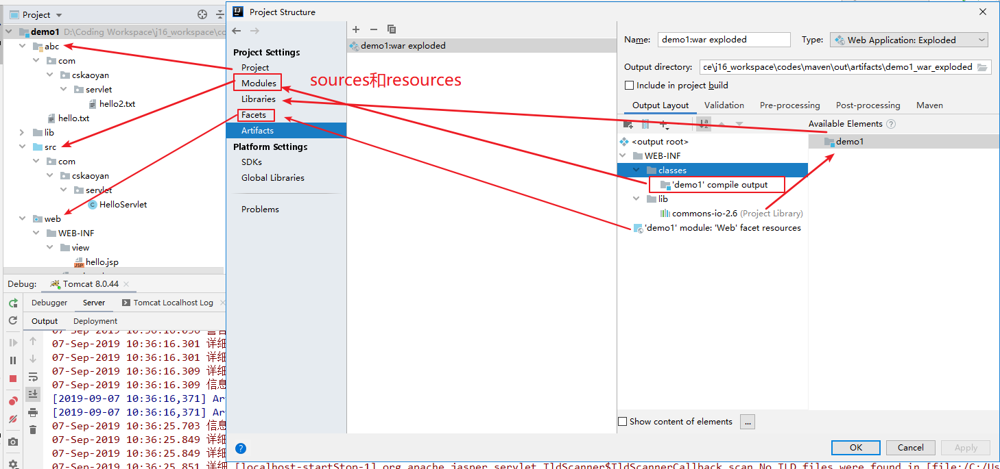
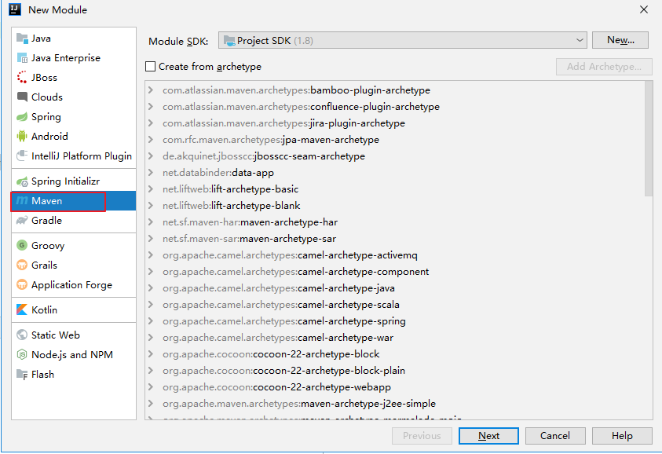
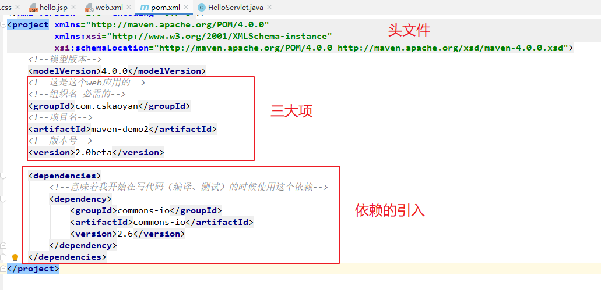
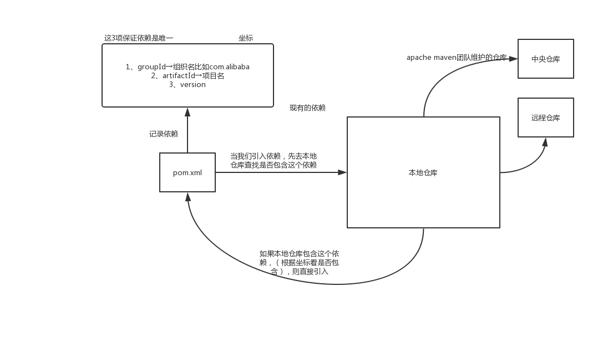
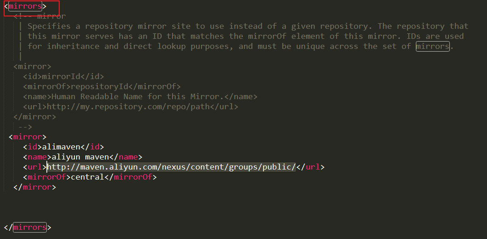
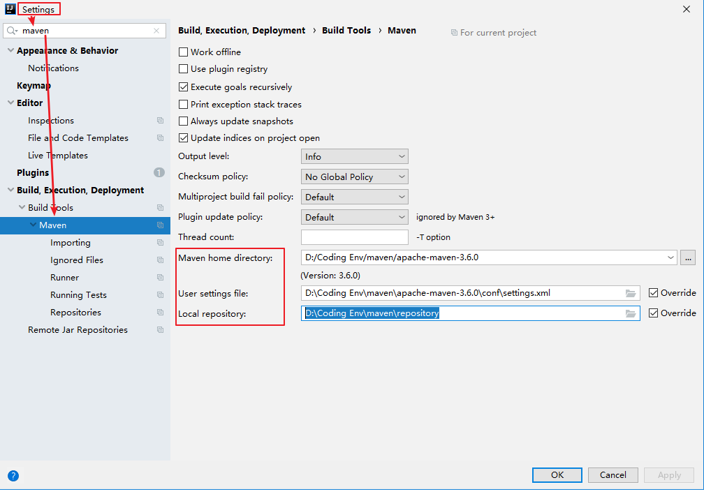
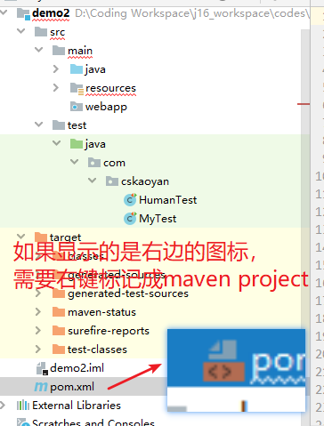
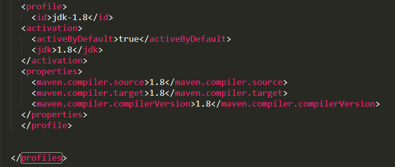
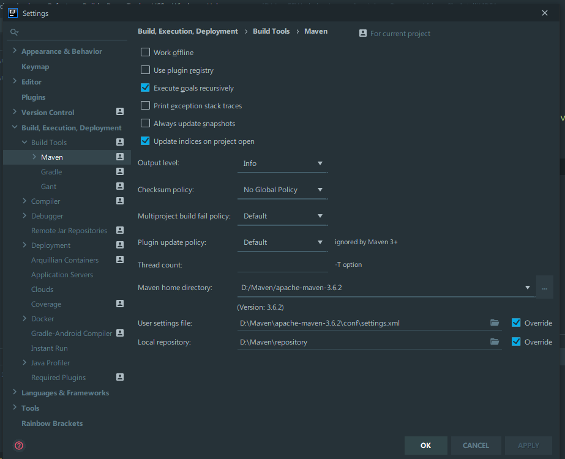
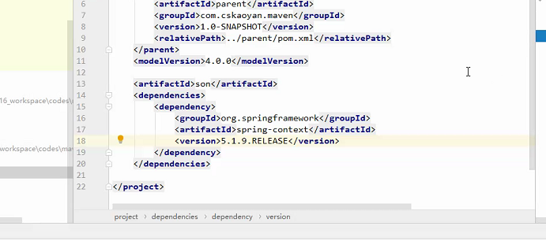

# Maven

1. 项目构建
2. 依赖管理(重点)

# Web项目基本知识



## 项目构建

过程


Clean：清理后续所有过程产生的文件

Compile：编译，不仅仅是class、同时包含将resources所对应的文件放到classes目录下

Test：单元测试、（Tests测试目录）所有的单元测试执行一遍、也会输出一个单元测试的报告

Package：将文件打包成jar或者war

## 依赖管理

对jar包的版本进行统一的管理

## Maven工程

配置文件：pom.xml (项目的根目录下)







## Maven的安装及使用

### 下载压缩包解压

### 配置环境变量

MAVEN_HOME:包含bin文件夹的目录

Path：%MAVEN_HOME%/bin

JAVA_HOME

输入mvn –v的时候出现版本号，意味着安装完成

### Maven配置

#### 指定本地仓库


#### 远程仓库

要注意的点：要在mirrors标签里配置mirror标签，推荐大家使用阿里云的镜像（远程仓库）



### Maven工程的目录结构

\--src

\--main 开发部署的代码配置文件等文件

\--java 放的是代码

\--resources 配置文件及资源文件

\--webapp web项目的根目录

\--test 单元测试相关的文件

> \--java 放的是测试代码

\--resources 测试配置文件及资源文件（可以不要，可以使用main下的配置文件）

\--pom.xml maven的配置文件

\--target 文件夹，项目构建相关流程产生的文件，都放在这个目录下

### Maven命令

#### mvn compile

编译：将java和resources目录下的代码和文件编译，编译到target/classes目录下

#### mvn clean

后续所有构建过程产生的文件都会被清理（删除）掉、target文件夹都会被删除掉

#### mvn test

执行单元测试，src\\test\\java所有包含\@Test注解的方法

如果单元测试执行失败不会执行后续的操作

执行失败原因：类名，包含Test

#### mvn package

执行打包：默认打包成jar包，文件名artifactId+version+打包类型

配置文件修改打包类型\<packaging\>war

要求：maven 写packaging=war

#### mvn install

将我们的项目安装到本地仓库

## idea中使用maven




## 父子工程

父工程：父工程又称为父控制器，只是一个简单的工程，不能单独运行。作用是将子模块跟子工程聚合在一起。父控制器中的pom.xml配置，在子模块跟子工程中都可以被继承。
子工程：项目中创建的具有业务逻辑并且可以单独部署的的子模块称为子工程，一个项目中不同的子工程通过在pom.xml中添加同一个父工程而整合在一起。
子模块：提取出了一些子工程中通用的模块，做成jar包。当子工程需要使用的时候只要在pom.xml中添加依赖就好了。


最近在看bilibili上面的SpringCloud又学了一下父子工程，父工程中往往需要配置很多信息，这里笔记记得很模糊简略。

```java
只是申明依赖，并不实现引用
<dependencyManagement>
</dependencyManagement>
```


## 子工程

## 补充

### Scope作用域

Compile：编译的时候需要并且要打包到应用（lib文件夹）（通常默认的是compile）

Provided：编译的时候需要 打包的时候不需要（通常只有servlet是provided）

Test：测试；scope为test的依赖只能由Tests目录下的代码使用，sources目录下代码不能使用（通常只有junit4和spring-test这两个依赖scope为test）


Runtime：运行
，编译的时候不需要，运行的时候需要（通常只有mysql-connector-java的scope为runtime）

### 使用maven要在网络良好的情况下使用

如果jar包没有下载下来 .lastupdated

如果依赖出现问题：去本地仓库检查→根据groupId、artifactId、version对应的文件夹去检查，如果jar包未下载，则清空重新下载

### 注意（一定注意）

当你引入一个其他人的maven工程的时候，首先要检查maven配置是否是自己的

### 注意点2



### Properties标签

\<properties\>同属于project的子标签


### Maven工程jdk1.5的问题

#### Maven的配置文件

Config/settings.xml

\<profiles\>标签



#### Maven工程的配置文件

Pom.Xml


### soureces和resources区别:

1.Sources存放工程的源代码；Resources存放工程的资源文件，例如properties/XML等文件

2.个人的理解是，凡是被Mark as为Sources和Resources下面的代码或者文件可以被Idea自动编译，编译后都放在target/classes文件下面。classpath就是指的classes这个文件下面的资源

### Maven本地仓库repository

C:\Users\Steve\.m2\repository   默认不用这个!


找仓库 

写web项目的时候 写一个package war 

常用工具类,可以打成jar包,放到本地仓库!

maven中的install 操作!

ctrl + w 选择上一级文件 (标签类)


将maven的config里面的setting设置完成以后,还需要在idea中的设置里面进行设置!



maven的安装目录要选择上,setting要选择上!然后他会自动选择上仓库!

单元测试中的名字Test T必须大写!

测试类,测试方法,上面加@Test(注解)

```java
public class MyTest { //这里的类名不能用Test
    //@Before
	//写实例化对象啥的
    @Test
    public void mytest(){
        People p = new People();
        String meat = p.eat("meat");
        String expectedValue = "meat";
        Assert.assertEquals(meat,expectedValue);
    }
    @After
	//关闭流啥的 
}
```

### 父子工程

父工程不写代码,只是提供一些配置文件!



配置profiles标签 

ctrl +shift + r 替换查找

创建一个maven项目,包含servlet

maven 3.6.2,在9.9号用不了,换成3.6.0可以用了!


常用的Maven项目自己配web项目需要的XML(因为系统生成的是2.3)

```
<?xml version="1.0" encoding="UTF-8"?>
<web-app xmlns="http://xmlns.jcp.org/xml/ns/javaee"
         xmlns:xsi="http://www.w3.org/2001/XMLSchema-instance"
         xsi:schemaLocation="http://xmlns.jcp.org/xml/ns/javaee http://xmlns.jcp.org/xml/ns/javaee/web-app_4_0.xsd"
         version="4.0">

</web-app>
```

要想让maven项目中的servlet能用,还需要添加一个依赖

```java
<dependency>
     <groupId>javax.servlet</groupId>
     <artifactId>javax.servlet-api</artifactId>
     <version>3.0.1</version>
     <scope>provided</scope>
</dependency>
<dependency>
     <groupId>javax.servlet.jsp</groupId>
     <artifactId>jsp-api</artifactId>
     <version>2.1</version>
     <scope>provided</scope>
</dependency>
```

每个里面还需要配置成1.8  pom.xml里面加一句话

```j
<properties>
        <!--key是我们的自定义标签-->
        <!--spring.version=5.1.0.RELEASE-->
        <spring.version>5.1.0.RELEASE</spring.version>
        <mysql.version>5.1.14</mysql.version>

        <maven.compiler.source>1.8</maven.compiler.source>
        <maven.compiler.target>1.8</maven.compiler.target>
        	<maven.compiler.compilerVersion>1.8</maven.compiler.compilerVersion>
</properties>
```

将普通JavaWeb项目改成Maven项目,需要将pom.xml考过去,还需要加servlet依赖

```java
 <dependency>
            <groupId>javax.servlet</groupId>
            <artifactId>servlet-api</artifactId>
            <version>3.0-alpha-1</version>
            <scope>provided</scope>
</dependency>
```

上面的是自己网上找的,下面的是老师上课写的!,最后需要将这个pom.xml文件,添加到maven project 

测试Test需要的依赖:

```xml
<dependencies>
        <dependency>
            <groupId>junit</groupId>
            <artifactId>junit</artifactId>
            <version>4.12</version>
            <scope>test</scope>
        </dependency>
</dependencies>
```

# 将一个项目变为maven项目

如果在其他地方写好的maven项目,在另一个电脑打开用,打开以后发现不是maven项目

(这时候是有maven对应的pom.xml文件的!)

只需要操作一步即可:

点击pom.xml  Add to mave project 即可! 由于项目已经是maven,所以没截图!


# 最近项目中常用的依赖:

```xml
<dependency>
            <groupId>org.springframework.boot</groupId>
            <artifactId>spring-boot-starter-data-jpa</artifactId>
        </dependency>
        <dependency>
            <groupId>org.springframework.boot</groupId>
            <artifactId>spring-boot-starter-data-redis</artifactId>
        </dependency>
        <dependency>
            <groupId>org.springframework.boot</groupId>
            <artifactId>spring-boot-starter-web</artifactId>
        </dependency>

        <!-- <dependency>
            <groupId>org.springframework.boot</groupId>
            <artifactId>spring-boot-devtools</artifactId>
            <scope>runtime</scope>
            <optional>true</optional>
        </dependency> -->

        <dependency>
            <groupId>org.springframework.boot</groupId>
            <artifactId>spring-boot-starter-websocket</artifactId>
            <version>2.0.4.RELEASE</version>
        </dependency>

        <dependency>
            <groupId>com.alibaba</groupId>
            <artifactId>druid-spring-boot-starter</artifactId>
            <version>1.1.10</version>
        </dependency>

        <dependency>
            <groupId>com.baomidou</groupId>
            <artifactId>mybatis-plus-boot-starter</artifactId>
            <version>3.1.2</version>
        </dependency>

        <dependency>
            <groupId>mysql</groupId>
            <artifactId>mysql-connector-java</artifactId>
            <scope>runtime</scope>
        </dependency>
        <dependency>
            <groupId>org.projectlombok</groupId>
            <artifactId>lombok</artifactId>
            <optional>true</optional>
        </dependency>
        <dependency>
            <groupId>org.springframework.boot</groupId>
            <artifactId>spring-boot-starter-test</artifactId>
            <scope>test</scope>
        </dependency>

        <dependency>
            <groupId>org.yeauty</groupId>
            <artifactId>netty-websocket-spring-boot-starter</artifactId>
            <version>0.8.0</version>
        </dependency>

        <dependency>
            <groupId>cn.hutool</groupId>
            <artifactId>hutool-all</artifactId>
            <version>5.0.5</version>
        </dependency>

        <!-- gt 验证 -->
        <dependency>
            <groupId>org.json</groupId>
            <artifactId>json</artifactId>
            <version>20160810</version>
        </dependency>

        <dependency>
            <groupId>commons-codec</groupId>
            <artifactId>commons-codec</artifactId>
            <version>1.9</version>
        </dependency>

        <!-- 文件上传 -->
        <dependency>
            <groupId>commons-io</groupId>
            <artifactId>commons-io</artifactId>
            <version>2.4</version>
        </dependency>

        <dependency>
            <groupId>commons-fileupload</groupId>
            <artifactId>commons-fileupload</artifactId>
            <version>1.3.3</version>
        </dependency>

        <dependency>
            <groupId>org.quartz-scheduler</groupId>
            <artifactId>quartz</artifactId>
            <version>2.2.1</version>
        </dependency>

        <dependency>
            <groupId>com.github.pagehelper</groupId>
            <artifactId>pagehelper</artifactId>
            <version>4.1.4</version>
        </dependency>

        <dependency>
            <groupId>com.alibaba</groupId>
            <artifactId>fastjson</artifactId>
            <version>1.2.47</version>
        </dependency>

        <!-- disruptor异步处理框架          -->
        <dependency>
            <groupId>com.lmax</groupId>
            <artifactId>disruptor</artifactId>
            <version>3.4.2</version>
        </dependency>

        <dependency>
            <groupId>org.apache.poi</groupId>
            <artifactId>poi</artifactId>
            <version>3.13</version>
        </dependency>
        <dependency>
            <groupId>org.apache.poi</groupId>
            <artifactId>poi-ooxml</artifactId>
            <version>3.13</version>
        </dependency>

        <dependency>
            <groupId>com.aliyun.oss</groupId>
            <artifactId>aliyun-sdk-oss</artifactId>
            <version>2.5.0</version>
        </dependency>
        
        <!--单元测试-->
        <dependency>
            <groupId>junit</groupId>
            <artifactId>junit</artifactId>
            <version>4.12</version>
            <scope>test</scope>
        </dependency>
```


# Interview

1.maven父子工程的父工程的包的类型是什么（pom类型）

2.maven。A项目依赖B项目，原因是用到了B项目的b接口（1.1.0版本）；C项目依赖B项目，用到了b接口的1.1.1版本；如果有一天A依赖C，会报错吗？如果报错怎么解决？


3.maven的生命周期


4..项目用maven做项目构建和依赖管理，那么maven的常用命令有哪些？


