# PrincipleOfComputerComposition

计算机组成原理

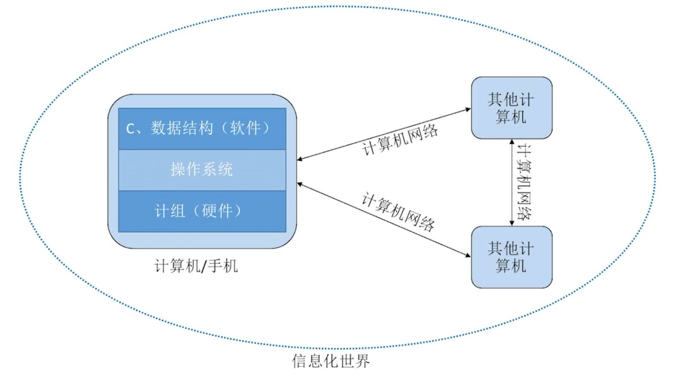

计算机只能识别0/1，对应硬件就是高低电平。

## 计算机系统概述

### 计算机发展历程

#### 计算机硬件的发展

##### 第一代 电子管

##### 第二代 晶体管

##### 第三代 集成电路

##### 第四代 大规模集成电路

#### 计算机软件的发展

C++ ，Java

Wins，UNIX，Linux

#### 计算机的分类和发展方向

#### 小结

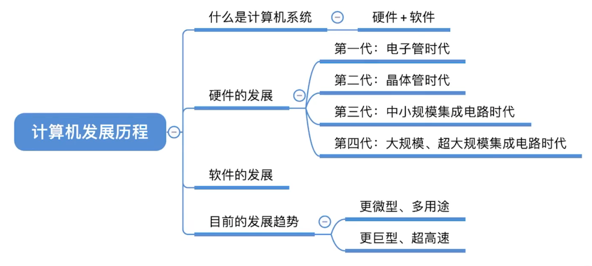

### 计算机系统层次结构

#### 计算机系统的组成

#### 计算机硬件的基本组成

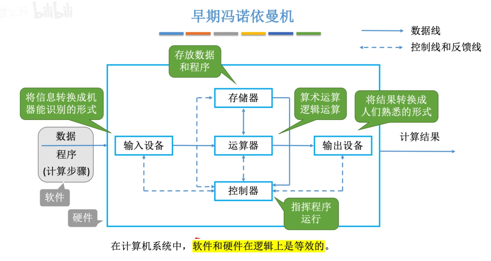

举例子：

对于乘法运算，可以设计一个专门的硬件电路实现乘法运算

也可以以软件的方式，执行多次加法运算来实现

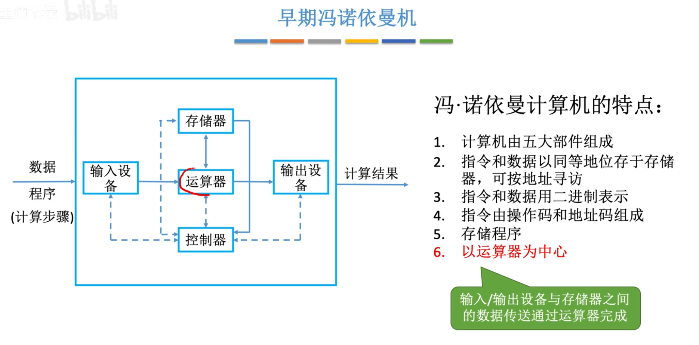

类比于下面这个：	

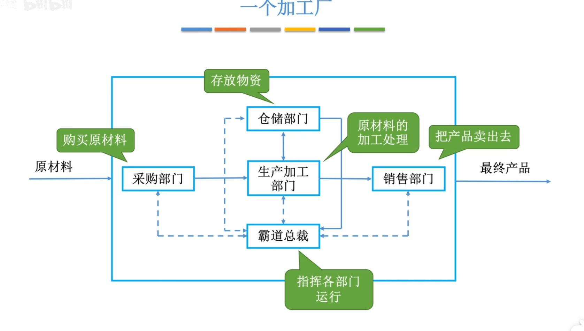

这个有缺点：采购部门可以直接将物资放入仓储部门，销售部门也可以直接在仓储部门取货，这样效率高，但是现实是这个设计所有的都需要经过生产加工部门，所以效率很慢。

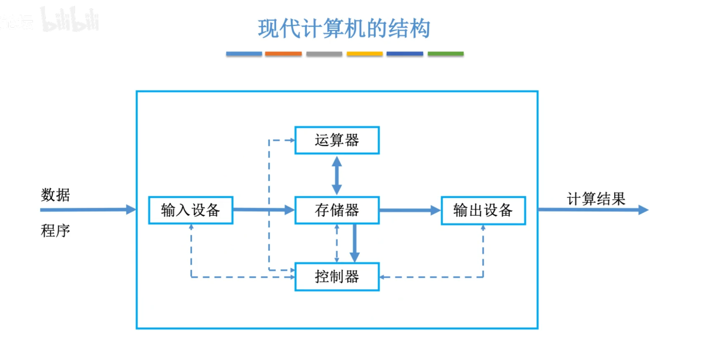

现代计算机以存储器为中心，这样就避免了上面的缺点。

上面的图简化图：

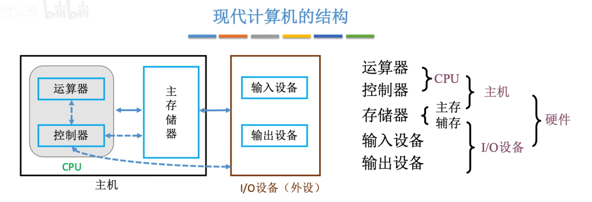

知识点回顾 

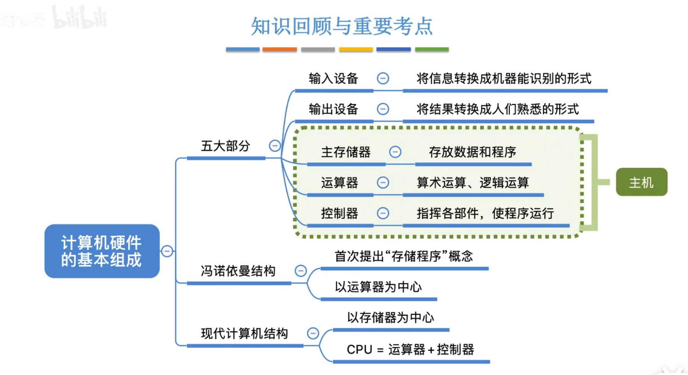

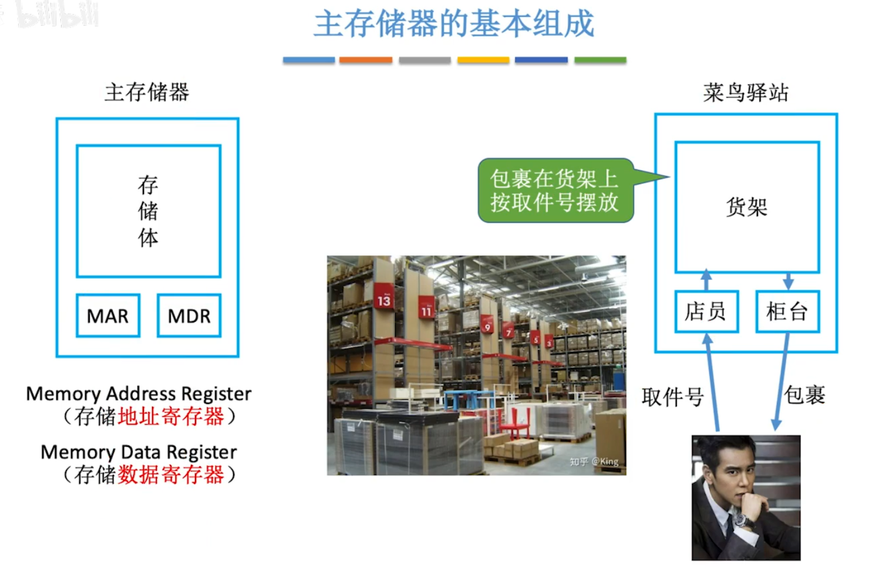

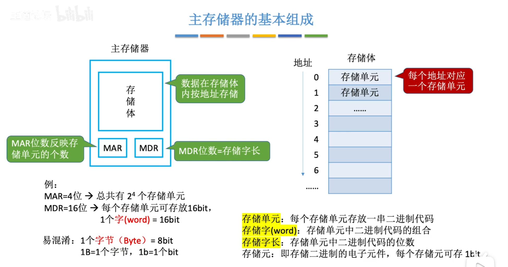

注意：

- 一个字（word）具体代表多少bit，要看具体的系统设计，在有的系统中代表32个bit，有些系统中代表64个bit
- 运营商所说的100Mbps宽带，指的是100M的b（比特），具体换算成M代表100/8 的速率。
- B和b不一样，一个代表字节，一个代表比特。

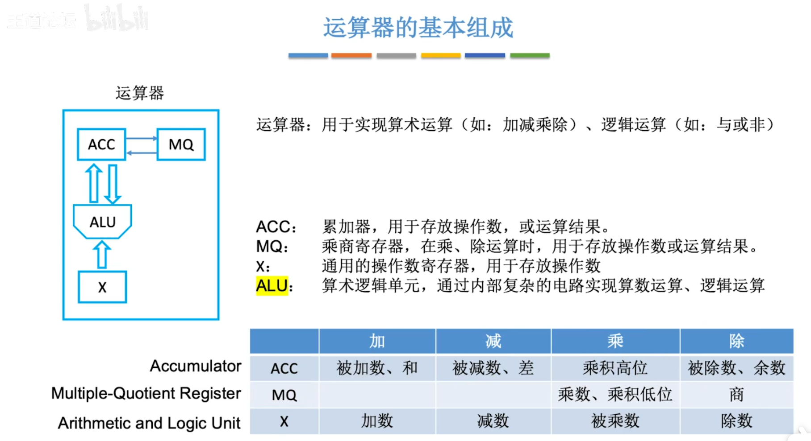

#### 计算机的软件分类

#### 计算机的工作过程想

### 计算机性能指标

## 数据的表示和运算

## 存储系统

## 指令系统

## 中央处理器

## 总线

## 输入输出系统