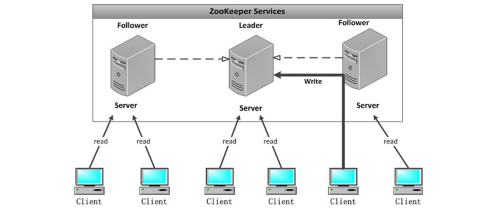
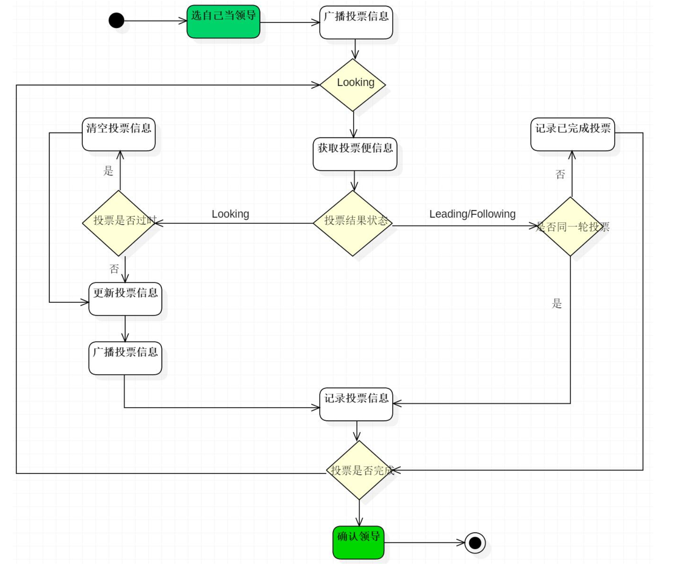
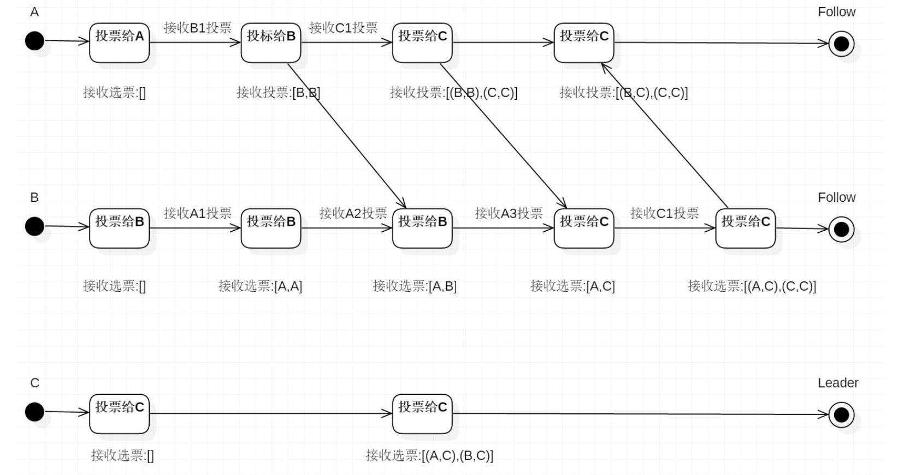

# Zookeeper

zookeeper  愿意是动物园管理员。

> 这里有些参考guide哥文章，JavaGuide 
>
> 还有很多不完善 后续自己会完善。

# Interview

## 1.zookeeper内部用的是什么算法

zookeeper 的核心是原子广播，这个机制保证了各个 server 之间的同步。实现这个机制的协议叫做 zab 协议。 zab 协议有两种模式，分别是恢复模式（选主）和广播模式（同步）。当服务启动或者在领导者崩溃后，zab 就进入了恢复模式，当领导者被选举出来，且大多数 server 完成了和 leader 的状态同步以后，恢复模式就结束了。状态同步保证了 leader 和 server 具有相同的系统状态。

https://blog.csdn.net/ronghao100/article/details/7384752

https://juejin.im/post/5b03d58a6fb9a07a9e4d8f01

## 2.zookeeper默认端口

## 3.zookeeper文件系统

## 4.如果zookper挂掉了，dubbo还能连接吗？

## 5.如果zookper挂掉了，但是此时新增了一台机器，这个时候dubbo还能连接上吗？

## 6.Zookeeper作为注册中心的功能是什么

## 7.zookeeper挂了怎么办

## 8.常用的注册中心有哪些

## 9.Zookeeper的作用

## 10.你们项目中Zookeeper是干嘛的？知道如何实现ZK的高可用吗？（集群、单数）

## 11.zookeeper，如果zookeeper挂了怎么办

## 12.zookeeper最少要配几台机器？

**Me**：需要配2台，其中1台作为备机

**面试官**：这是物理机，服务器最少要2台。换一个问法，zookeeper的注册中心，注册dubbo最少需要几台机器，机器可以是虚拟的，说白了就是想问zookeeper的机制是什么，一个机器宕机了，它的分配原则，要知道这个才知道最少要分配几台？

**Me**：不会

**面试官**：首先是要奇数台，偶数台选不出谁是leader，最少3台才会知道哪一台是leader

## 13.zookeeper的主节点挂了怎么恢复？

## 14.zookeeper有什么作用？知道底层具体是怎么实现的吗

## 15.zookper挂掉的话有想过哪些原因吗？

## 16.zookeeper的实现了解吗

## 17.Zooleeper为什么要用奇数台？

所谓的zookeeper容错是指，当宕掉几个zookeeper服务器之后，剩下的个数必须大于宕掉的个数的话整个zookeeper才依然可用。假如我们的集群中有n台zookeeper服务器，那么也就是剩下的服务数必须大于n/2。先说一下结论，2n和2n-1的容忍度是一样的，都是n-1，大家可以先自己仔细想一想，这应该是一个很简单的数学问题了。
比如假如我们有3台，那么最大允许宕掉1台zookeeper服务器，如果我们有4台的的时候也同样只允许宕掉1台。
假如我们有5台，那么最大允许宕掉2台zookeeper服务器，如果我们有6台的的时候也同样只允许宕掉2台。

综上，何必增加那一个不必要的zookeeper呢？

## 18.zookeeper 选举机制

原文转自：https://www.cnblogs.com/ASPNET2008/p/6421571.html

​                 https://blog.csdn.net/cnh294141800/article/details/52959028/

​                 http://blog.itpub.net/30109892/viewspace-2089610/

#### 一、zookeeper集群

配置多个实例共同构成一个集群对外提供服务以达到水平扩展的目的，每个服务器上的数据是相同的，每一个服务器均可以对外提供读和写的服务，这点和redis是相同的，即对客户端来讲每个服务器都是平等的。

这篇主要分析leader的选择机制，zookeeper提供了三种方式：

- LeaderElection  
- AuthFastLeaderElection
- FastLeaderElection （最新默认）

默认的算法是FastLeaderElection，所以这篇主要分析它的选举机制。

#### 二、选举流程简述

目前有5台服务器，每台服务器均没有数据，它们的编号分别是1,2,3,4,5,按编号依次启动，它们的选择举过程如下：

- 服务器1启动，给自己投票，然后发投票信息，由于其它机器还没有启动所以它收不到反馈信息，服务器1的状态一直属于Looking(选举状态)。
- 服务器2启动，给自己投票，同时与之前启动的服务器1交换结果，由于服务器2的编号大所以服务器2胜出，但此时投票数没有大于半数，所以两个服务器的状态依然是LOOKING。
- 服务器3启动，给自己投票，同时与之前启动的服务器1,2交换信息，由于服务器3的编号最大所以服务器3胜出，此时投票数正好大于半数，所以服务器3成为领导者，服务器1,2成为小弟。
- 服务器4启动，给自己投票，同时与之前启动的服务器1,2,3交换信息，尽管服务器4的编号大，但之前服务器3已经胜出，所以服务器4只能成为小弟。
- 服务器5启动，后面的逻辑同服务器4成为小弟。

#### 三、选择机制中的概念

#### 1、Serverid：服务器ID

比如有三台服务器，编号分别是1,2,3。

> 编号越大在选择算法中的权重越大。

#### 2、Zxid：数据ID

服务器中存放的最大数据ID.

> 值越大说明数据越新，在选举算法中数据越新权重越大。

#### 3、Epoch：逻辑时钟

或者叫投票的次数，同一轮投票过程中的逻辑时钟值是相同的。每投完一次票这个数据就会增加，然后与接收到的其它服务器返回的投票信息中的数值相比，根据不同的值做出不同的判断。

#### 4、Server状态：选举状态

- LOOKING，竞选状态。
- FOLLOWING，随从状态，同步leader状态，参与投票。
- OBSERVING，观察状态,同步leader状态，不参与投票。
- LEADING，领导者状态。

#### 四、选举消息内容

在投票完成后，需要将投票信息发送给集群中的所有服务器，它包含如下内容。

- 服务器ID
- 数据ID
- 逻辑时钟
- 选举状态

#### 五、选举流程图

因为每个服务器都是独立的，在启动时均从初始状态开始参与选举，下面是简易流程图。

#### 六、选举状态图

描述Leader选择过程中的状态变化，这是假设全部实例中均没有数据，假设服务器启动顺序分别为：A,B,C。

#### 七、判断是否已经胜出

默认是采用投票数大于半数则胜出的逻辑。

#### 八、选举流程详述

一、首先开始选举阶段，每个Server读取自身的zxid。

二、发送投票信息

   a、首先，每个Server第一轮都会投票给自己。

   b、投票信息包含 ：所选举leader的Serverid，Zxid，Epoch。Epoch会随着选举轮数的增加而递增。

三、接收投票信息

  1、如果服务器B接收到服务器A的数据（服务器A处于选举状态(LOOKING 状态)

​     1）首先，判断逻辑时钟值：

　　　　a）如果发送过来的逻辑时钟Epoch大于目前的逻辑时钟。首先，更新本逻辑时钟Epoch，同时清空本轮逻辑时钟收集到的来自其他server的选举数据。然后，判断是否需要更新当前自己的选举leader Serverid。判断规则rules judging：保存的zxid最大值和leader Serverid来进行判断的。先看数据zxid,数据zxid大者胜出;其次再判断leader Serverid,leader Serverid大者胜出；然后再将自身最新的选举结果(也就是上面提到的三种数据（leader Serverid，Zxid，Epoch）广播给其他server)

　　　　b）如果发送过来的逻辑时钟Epoch小于目前的逻辑时钟。说明对方server在一个相对较早的Epoch中，这里只需要将本机的三种数据（leader Serverid，Zxid，Epoch）发送过去就行。

　　　　c）如果发送过来的逻辑时钟Epoch等于目前的逻辑时钟。再根据上述判断规则rules judging来选举leader ，然后再将自身最新的选举结果(也就是上面提到的三种数据（leader  Serverid，Zxid，Epoch）广播给其他server)。

​    2）其次，判断服务器是不是已经收集到了所有服务器的选举状态：若是，根据选举结果设置自己的角色(FOLLOWING还是LEADER)，退出选举过程就是了。

最后，若没有收到没有收集到所有服务器的选举状态：也可以判断一下根据以上过程之后最新的选举leader是不是得到了超过半数以上服务器的支持,如果是,那么尝试在200ms内接收一下数据,如果没有新的数据到来,说明大家都已经默认了这个结果,同样也设置角色退出选举过程。

  2、 如果所接收服务器A处在其它状态（FOLLOWING或者LEADING）。

　　　　a)逻辑时钟Epoch等于目前的逻辑时钟，将该数据保存到recvset。此时Server已经处于LEADING状态，说明此时这个server已经投票选出结果。若此时这个接收服务器宣称自己是leader, 那么将判断是不是有半数以上的服务器选举它，如果是则设置选举状态退出选举过程。
　　　　b) 否则这是一条与当前逻辑时钟不符合的消息，那么说明在另一个选举过程中已经有了选举结果，于是将该选举结果加入到outofelection集合中，再根据outofelection来判断是否可以结束选举,如果可以也是保存逻辑时钟，设置选举状态，退出选举过程。

 

参考文章：

https://www.cnblogs.com/felixzh/p/5869212.html

https://blog.csdn.net/cnh294141800/article/details/52959028/

## 19过半机制

